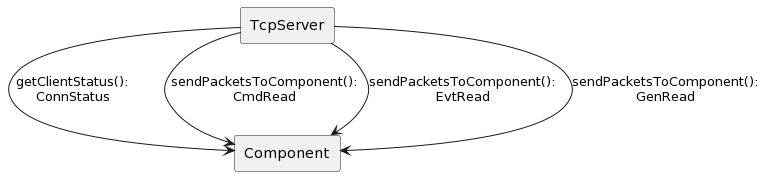
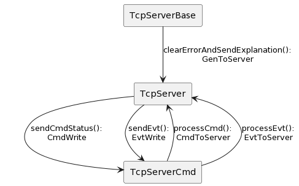
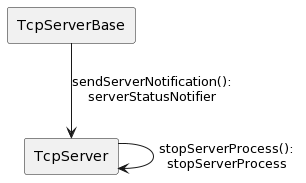
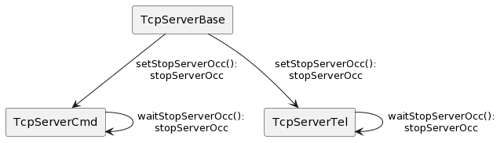

# TCP Server Communication Diagram

## Overview

The Communication Diagram shows how internal objects interact in **TcpServer** top-level class, along with messages that travel from one to another.

## Diagram Conventions

The [PlantUML](https://plantuml.com) is used to draw the Communication Diagram.
Although it does not support this diagram natively, it is still possible to emulate the expected behavior.
The objects with functions related to communication are in rectangle boxes.
The arrow between objects gives the direction of communication and the related LabVIEW synchronization technique.

This document shows `User Events`, `Notifiers`, and `Occurrences`.

## User Events

The following is the list of user events:

| id | User Event  | Data Type | Name       |
|:--:|:-----------:|:---------:|:----------:|
| 1  | CmdRead     | string    | TcpPacket  |
| 2  | EvtRead     | string    | TcpPacket  |
| 3  | GenRead     | string    | TcpPacket  |
| 4  | ConnStatus  | boolean   | ConnStatus |
| 5  | GenToServer | string    | TcpPacket  |
| 6  | CmdToServer | string    | TcpPacket  |
| 7  | EvtToServer | string    | TcpPacket  |
| 8  | CmdWrite    | string    | TcpPacket  | 
| 9  | EvtWrite    | string    | TcpPacket  |

In the following user events description, `TcpPacket` is the message sent by the TCP client to the TCP server as a JSON string.
The `Component` is the piece of software that uses this library.

- `CmdRead`, `EvtRead`, and `GenRead` is used to send the `TcpPacket` from **TcpServer** to the Component.
- `ConnStatus` is used to inform the Component when servers connect or disconnect.
- `GenToServer` is used to send a generic message to **TcpServer**.
- `CmdToServer` is used to send the `TcpPacket` to **TcpServer** when the incoming command is legal.
- `EvtToServer` is used to send the `TcpPacket` to **TcpServer** when the incoming event is legal.
- `CmdWrite` is used to send the ACK to the TCP client with the command result (success or fail).
- `EvtWrite` is used to send an event to the TCP client from the Component.

The following table shows the user events with their publishers and subscribers:

| User Event  | Publisher                    | Subscriber                |
|:-----------:|:----------------------------:|:-------------------------:|
| CmdRead     | TcpServer.sendPacketsToComponent.vi | ComponentSimulator.vi     |
| EvtRead     | TcpServer.sendPacketsToComponent.vi | ComponentSimulator.vi     |
| GenRead     | TcpServer.sendPacketsToComponent.vi | ComponentSimulator.vi     |
| ConnStatus  | TcpServer.getClientStatus.vi | ComponentSimulator.vi     |
| GenToServer | TcpServerBase.clearErrorAndSendExplanation.vi | TcpServer.sendPacketsToComponent.vi |
| GenToServer | TcpServerCmd.processPacket.vi | TcpServer.sendPacketsToComponent.vi |
| CmdToServer | TcpServerCmd.processCmd.vi   | TcpServer.sendPacketsToComponent.vi |
| EvtToServer | TcpServerCmd.processEvt.vi | TcpServer.sendPacketsToComponent.vi |
| CmdWrite    | TcpServer.sendCmdStatus.vi   | TcpServerCmd.runServer.vi |
| EvtWrite    | TcpServer.sendEvt.vi         | TcpServerCmd.runServer.vi |

This table shows the vi that publishes an user event and which vi subscribes to that user event.

**TcpServerBase** is the parent class of **TcpServerCmd** and **TcpServerTel**.
**TcpServerCmd** is the class that handles commands and events.
**TcpServerTel** is the class that handles telemetry messages.

**TcpServerCmd** and **TcpServerTel** are part of the **TcpServer** class.
Go [here](../doc/uml/TcpServerClass.uml) to know more details about the class diagram.

The **ComponentSimulator.vi** is used to test the API and allows the user know how to use the API.
You can see that **ComponentSimulator.vi** will subscribe to the first four user events.
They are defined in the following section.

### Top-Level User Events

The top-level user events are closest to the user.
The following is the list:

| id | User Event |
|:--:|:----------:|
| 1  | CmdRead    |
| 2  | EvtRead    |
| 3  | GenRead    |
| 4  | ConnStatus |

The communication diagram UML for the top-level user events is in [here](../doc/uml/TcpServerCommDiagramTopLevel.uml).

The TCP server will receive the valid and registered JSON packet from TCP client. 
This packet will be sent to the Component from **TcpServer.sendPacketsToComponent.vi**.

For any change of TCP/IP connection status, the Component will receive a `ConnStatus` user event from **TcpServer.getClientStatus.vi**.
It uses a boolean to give the connection status.

### Down-Level User Events

The down-level user events are not closest to the user.
The following is the list:

| id | User Event  |
|:--:|:-----------:|
| 5 | GenToServer  |
| 6 | CmdToServer  |
| 7 | EvtToServer  |
| 8 | CmdWrite     |
| 9 | EvtWrite     |

The communication diagram UML for the down-level user events is in [here](../doc/uml/TcpServerCommDiagramDownLevel.uml).

The TCP server will inspect if the received JSON packet from the TCP client is valid or not.
In the **TcpServerCmd.processCmd.vi**, it will check if the received command is registered or not.
The sequence ID will be compared with the previous messages to see it is in the order or not.
If this is a legal command, the server will send the `TcpPacket` to **TcpServer** by `CmdToServer` user event.

After the TCP server inspects if the received JSON packet from the TCP client is valid or not, the **TcpServer.sendCmdStatus.vi** sends the ACK to the **TcpServerCmd.runServer.vi** by the `CmdWrite` user event.
It uses the `ackTypeDef` with the `sequence_id` and the `cmdStatus`.

The **TcpServerCmd.processEvt.vi** checks the `compname` (component name) and `id`.
If the event is registered, it will be sent to the `TcpServer` by the `EvtToServer` user event.

If the incoming message is not a command nor an event, the "unknown" `TcpPacket` will be sent to the **TcpServer** using the `GenToServer` user event from **TcpServerCmd.processPacket.vi**.

If there is an error, **TcpServerBase.clearErrorAndSendExplanation.vi** will clean it and send the explanation to the **TcpServer** using the `GenToServer` user event.

If an `event` is sent to the TCP client, the Component uses the **TcpServerCmd.sendEvt.vi** with the `event id` and the `event details`. It uses the `EvtWrite` user event.

## Notifiers

The following is the list of notifiers:

| id | Notifier             | Data Type                    |
|:--:|:--------------------:|:----------------------------:|
| 1  | serverStatusNotifier | cluster (boolean and string) |
| 2  | stopServerProcess    | boolean                      |

The following table shows the notifiers with their publishers and subscribers:

| Notifier    | Publisher                    | Subscriber                |
|:-----------:|:----------------------------:|:-------------------------:|
| serverStatusNotifier | TcpServerBase.sendServerNotification.vi | TcpServer.readNotifierStatus.vi |
| stopServerProcess | TcpServer.stopServerProcess.vi | TcpServer.waitToStopServerProcess.vi |

The communication diagram UML for notifiers is in [here](../doc/uml/communicationDiagramNotifiers.uml).

The **sendServerNotification.vi** fires the notifier when TCP Client connects or disconnects.
This VI is a function of **TcpServerBase** class and is instantiated by **TcpServerCmd** and **TcpServerTel** to inform **TcpServer** when any of them connects or disconnects.
This VI is set as preallocated reentrant clone execution.

The **readNotifierStatus.vi** reads the notifier sent from **TcpServerCmd.tcpServerStateMachine.vi** and **TcpServerTel.tcpServerStateMachine.vi**.
It has the `serverSelection` control to select which server receives the notifier from.
This VI is set as preallocated reentrant clone execution.

The **stopServerProcess** fires the notifier to stop a process running inside of **runServer.vi**.

The **waitToStopServerProcess.vi** waits to stop a process inside of **runServer.vi**. 
This is a non-block call function and is set as preallocated reentrant clone execution.
Use this VI any time you add a new process running in parallel inside of **runServer.vi**.

## Occurrence

The following is the list of occurrences:

| id | Occurrence    |
|:--:|:-------------:|
| 1  | stopServerOcc |

The `stopServerOcc` is used to stop all servers at same time. 

The following table shows the occurrences with their publishers and subscribers:

| Occurrence    | Publisher                    | Subscriber                |
|:-----------:|:----------------------------:|:-------------------------:|
| stopServerOcc | TcpServerBase.setStopServerOcc.vi | TcpServerCmd.waitStopServerOcc.vi |
| stopServerOcc | TcpServerBase.setStopServerOcc.vi | TcpServerTel.waitStopServerOcc.vi |

The communication diagram UML for occurrences is in [here](../doc/uml/communicationDiagramOccurrences.uml).

The **setStopServerOcc.vi** sets the occurrence.
The `stopServerOcc` attribute is instantiated by **TcpServerCmd.waitStopServerOcc.vi** and **TcpServerTel.waitStopServerOcc.vi**, both waiting for this occurrence as a non-block call function.
These vis are called by the **TcpServerCmd.runServer.vi** and **TcpServerTel.runServer.vi**, respectively.
