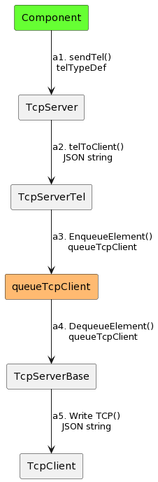
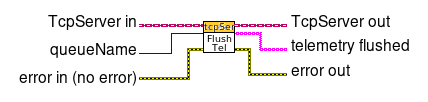
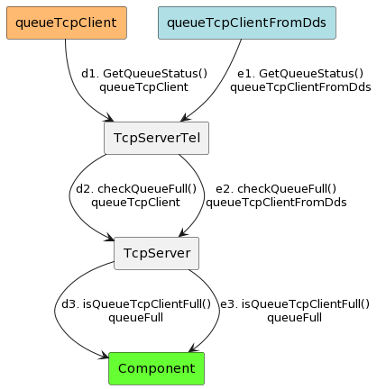
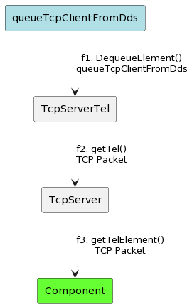
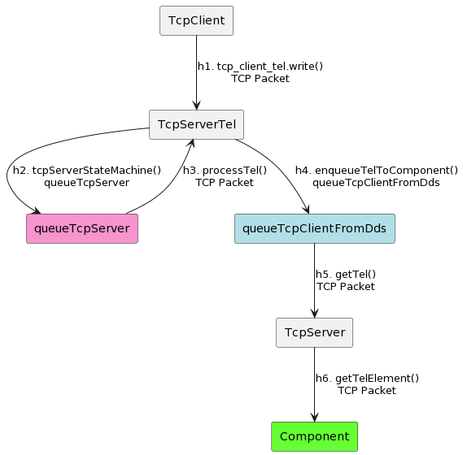
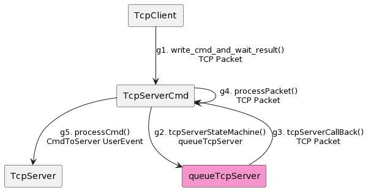

# Queues Communication Diagram

## Overview

This Communication Diagram shows how the **TcpServer** uses queues internally to share data among classes.

## Diagram Conventions

The [PlantUML](https://plantuml.com) is used to draw the Communication Diagram.
Although it does not support this diagram natively, it is still possible to emulate the expected behavior.

## List of Queues

The following is the list of queues in **TcpServer**:

| Queue Name |
|:----------:|
| queueTcpServer    |
| queueTcpClient    |
| queueTcpClientFromDds    |

## Queues Description

The following section will describe the queues:

- The `queueTcpServer` is a **TcpServerBase** attribute. It stores commands, events and telemetry comming from the TCP Client as TCP Packets.
- The `queueTcpClient` is a **TcpServerBase** attribute.
It stores telemetry that is sent from the Component to the TCP Client.
This queue has a max queue size set by the **TcpServer.configServer&#46;vi** with the `maxSizeQueueTcpClient` control.
User can use the **queueOptionsTypeDef&#46;ctl** to set the Timeout (ms), and how to add new elements into this queue.
- The `queueTcpClientFromDds` is a **TcpServerTel** attribute.
It is used to receive the processed telemetry ready to be sent to the Component.
The **TcpServer.configServer&#46;vi** sets the max queue size with the `maxSizeQueueTcpClientFromDds` control, the timeout (ms) with the `timeoutQueueTcpClientFromDds` control, and how to add new elements into this queue, with the `EnqueueOptions` control.

The following table shows the queues with their enqueue and dequeue functions:

| Queue | Enqueue | Dequeue |
|:--------:|:----------:|:-----------:|
| queueTcpServer  | TcpServerCmd.tcpServerStateMachine&#46;vi   | TcpServerCmd.tcpServerCallBack&#46;vi     |
| queueTcpServer  | TcpServerTel.tcpServerStateMachine&#46;vi   | TcpServerTel.tcpServerCallBack&#46;vi     |
| queueTcpClient  |  TcpServerTel.enqueueTelToClient&#46;vi  | TcpServerBase.tcpServerSenderLoop&#46;vi     |
| queueTcpClientFromDds  | TcpServerTel.enqueueTelToComponent&#46;vi   | TcpServerTel.getTel&#46;vi     |

## Communication Diagrams

The following sections will present differents routs where queues interacts with classes.

### Send Telemetry from Component to TCP Client

User sends the telemetry to the TCP Client with the **sendTel()&#46;vi** (a1) using the **telTypeDef&#46;ctl**.
The **telToClient&#46;vi** (a2) converts the telemetry into a JSON string, and then the **enqueueTelToClient&#46;vi** (a3) put the telemetry into the `queueTcpClient` queue.
In (a4) the **TcpServerBase.tcpServerSenderLoop&#46;vi** instance dequeues the telemetry as a JSON string and is ready to be sent to the TCP Client with the **Write TCP** LabVIEW function (a5).

The Communication Diagram for this is in [here](../doc/uml/telemetryToClient.uml).

### Flush the Queue

User can flush the `queueTcpClient` (b1) and the `queueTcpClientFromDds` (c1) using the **flushTelQueue&#46;vi**.
In (b2) and (c2) the **flushTel&#46;vi** will get the queue reference, and then (b3) and (c3) will flush the queues using the **Flush Queue&#46;vi** LabVIEW function.

The Communication Diagram for this is in [here](../doc/uml/telemetryToClient.uml).

### Get Queue Status

When User needs to know if the `queueTcpClient` (d1) and the `queueTcpClientFromDds` (e1) is full or not, the **Get Queue Status** LabVIEW functon is called by the **checkQueueFull&#46;vi** (d2) and (e2), and then the **isQueueTcpClientFull&#46;vi** informs the User the status of the queues with the `queueFull` boolean, in (d3) and (e3).

The Communication Diagram for this is in [here](../doc/uml/getQueueStatus.uml).

### Get One Instance of Telemetry

When the User needs one instance of telemetry, the **Dequeue Element** LabVIEW function (f1) is called by the **getTel&#46;vi** (f2), and then the User can receive the TCP packet with the **getTelElement&#46;vi** (f3).

The Communication Diagram for this is in [here](../doc/uml/getTelElement.uml).

### Send Telemetry from TCP Client to Component

TCP Client sends telemetry with the **tcp_client_tel.write** function (h1) and is received by the **tcpServerStateMachine&#46;vi** (h2) with the **TCP Read** LabVIEW function.
The TCP Packet received is enqueued into the `queueTcpServer` queue.
The telemetry is processed by the **processTel&#46;vi** (h3) and enqueued into the `queueTcpClientFromDds` by the **enqueueTelToComponent&#46;vi** (h4).
Telemetry is dequeued by the **getTel&#46;vi** (h5) and then the User can read it using the **getTelElement&#46;vi** (h6).

The Communication Diagram for this is in [here](../doc/uml/telemetryToComponent.uml).

### Send Command from TC Client to Component

TCP Client sends a command with the **write_cmd_and_wait_result** function (g1).
This command is received as a TCP Packet by the **tcpServerStateMachine&#46;vi** (g2) and enqueued into the `queueTcpServer` queue.
The TCP Packet is dequeued (g3) by the **tcpServerCallBack&#46;vi** and checked if is a command or an event by the **processPacket.vi** (g4).
If the TCP Packet is a command it will be processed by the **processCmd&#46;vi** (g5) to check if is registered or not, and then is sent as an `user event` with the `CmdRead` reference.

The Communication Diagram for this is in [here](../doc/uml/commandToComponent.uml).
