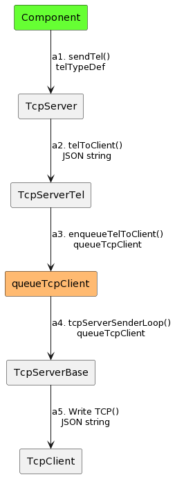
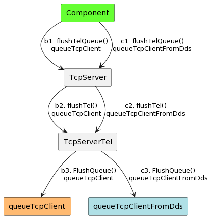

# Queues Communication Diagram

## Overview

This Communication Diagram shows how the **TcpServer** uses queues internally to share data among classes.

## Diagram Conventions

The [PlantUML](https://plantuml.com) is used to draw the Communication Diagram.
Although it does not support this diagram natively, it is still possible to emulate the expected behavior.

## List of Queues

The following is the list of queues in **TcpServer**:

| Queue Name |
|:----------:|
| queueTcpServer    |
| queueTcpClient    |
| queueTcpClientFromDds    |
| queueStateMachine |

## Queues Description

The descriptions of queues are in the following:

- **TcpServerBase.queueTcpServer** stores commands, events, and telemetry coming from the TCP Client as TCP Packets.
- **TcpServerBase.queueTcpClient** stores telemetry from Component to TCP Client.
This queue has a max queue size set by the **TcpServer.configServer&#46;vi** with the `maxSizeQueueTcpClient` control.
User can use the **queueOptionsTypeDef&#46;ctl** to set the Timeout (ms), and how to add new elements into this queue.
- **TcpServerTel.queueTcpClientFromDds** receives the processed telemetry ready to be sent to Component.
**TcpServer.configServer&#46;vi** sets: (1) max queue size with the `maxSizeQueueTcpClientFromDds` control, (2) timeout (ms) with the `timeoutQueueTcpClientFromDds` control, and (3) enqueue method with the `EnqueueOptions` control.
- **TcpServerBase.queueStateMachine** changes the states in the TCP/IP state machine.

The following table shows the queues with their enqueue and dequeue functions:

| Queue | Enqueue | Dequeue |
|:--------:|:----------:|:-----------:|
| queueTcpServer  | TcpServerCmd.tcpServerStateMachine&#46;vi   | TcpServerCmd.tcpServerCallBack&#46;vi        |
| queueTcpServer  | TcpServerTel.tcpServerStateMachine&#46;vi   | TcpServerTel.tcpServerCallBack&#46;vi        |
| queueTcpClient  |  TcpServerTel.enqueueTelToClient&#46;vi  | TcpServerBase.tcpServerSenderLoop&#46;vi        |
| queueTcpClientFromDds  | TcpServerTel.enqueueTelToComponent&#46;vi   | TcpServerTel.getTel&#46;vi            |
| queueStateMachine  | TcpServerCmd.runServer&#46;vi   | TcpServerCmd.tcpStateMachine&#46;vi                   |
| queueStateMachine  | TcpServerTel.runServer&#46;vi   | TcpServerTel.tcpStateMachine&#46;vi                   |
| queueStateMachine  | TcpServerCmd.tcpServerStateMachine&#46;vi   | TcpServerCmd.tcpServerStateMachine&#46;vi |
| queueStateMachine  | TcpServerTel.tcpServerStateMachine&#46;vi   | TcpServerTel.tcpServerStateMachine&#46;vi |

## Communication Diagrams

The relationship (or route) among the queues and classes is in the following sections.

### Send Telemetry from Component to TCP Client

- a1. The user sends the telemetry to the TCP Client with **sendTel&#46;vi** using **telTypeDef&#46;ctl**.
- a2. The **telToClient&#46;vi** converts the telemetry into a JSON string.
- a3. The **enqueueTelToClient&#46;vi** puts the telemetry into `queueTcpClient` queue.
- a4. The **TcpServerBase.tcpServerSenderLoop&#46;vi** dequeues the telemetry as a JSON string.
- a5. The **TcpServerBase** sends the message to TCP Client with **Write TCP**.vi function.

The Communication Diagram for this is in [here](../doc/uml/telemetryToClient.uml).

### Flush the Queue

- b1. The user flushes `queueTcpClient` using **flushTelQueue&#46;vi**.
- b2. The **flushTel&#46;vi** gets `queueTcpClient` reference.
- b3. The **Flush Queue&#46;vi** LabVIEW function flushes the queue.

- c1. The user flushes `queueTcpClientFromDds` using **flushTelQueue&#46;vi**.
- c2. The **flushTel&#46;vi** gets `queueTcpClientFromDds` reference.
- c3. The **Flush Queue&#46;vi** LabVIEW function flushes the queue.

The Communication Diagram for this is in [here](../doc/uml/telemetryToClient.uml).

### Get Queue Status

- d1. The **Get Queue Status** LabVIEW function returns information about the number of elements currently in `queueTcpClient`.
- d2. The **checkQueueFull&#46;vi** compares the currently number of elements in the queue with the **TcpServerBase.maxSizeQueueTcpClient** to know if queue is full or not.
The result of this comparison is in the `queueFull` boolean.
- d3. The **TcpServer** informs the status of queue with **isQueueTcpClientFull&#46;vi** and `queueFull` boolean.

- e1. The **Get Queue Status** LabVIEW function returns information about the number of elements currently in `queueTcpClientFromDds`.
- e2. The **checkQueueFull&#46;vi** compares the currently number of elements in the queue with the **TcpServerBase.maxSizeQueueTcpClientFromDds** to know if queue is full or not.
The result of this comparison is in the `queueFull` boolean.
- e3. The **TcpServer** informs the status of queue with **isQueueTcpClientFull&#46;vi** and `queueFull` boolean.

The Communication Diagram for this is in [here](../doc/uml/getQueueStatus.uml).

### Get One Instance of Telemetry

- f1. The **Dequeue Element** LabVIEW function removes an element from the front of the `queueTcpClientFromDds` and returns the element.
- f2. The **getTel&#46;vi** gets queue reference and calls the previous function.
- f3. The **TcpServer** sends one instance of telemetry as TCP packet with the **getTelElement&#46;vi**.

The Communication Diagram for this is in [here](../doc/uml/getTelElement.uml).

### Send Telemetry from TCP Client to Component

- h1. The TCP Client sends telemetry with the **tcp_client_tel.write** function.
- h2. The telemetry is received by **tcpServerStateMachine&#46;vi** with **TCP Read** LabVIEW function, and is enqueued into `queueTcpServer` queue.
- h3. The **processTel&#46;vi** processes the TCP Packet.
- h4. The **enqueueTelToComponent&#46;vi** enqueues the processed TCP Packet into `queueTcpClientFromDds`.
- h5. The **getTel&#46;vi** dequeues telemetry from `queueTcpClientFromDds`.
- h6. The **TcpServer** sends telemetry as TCP Packet with the **getTelElement&#46;vi**.

The Communication Diagram for this is in [here](../doc/uml/telemetryToComponent.uml).

### Send Command from TC Client to Component

- g1. TCP Client sends a command with the **write_cmd_and_wait_result** function.
- g2. This command is received as a TCP Packet by the **tcpServerStateMachine&#46;vi**, and is enqueued into `queueTcpServer` queue.
- g3. The **tcpServerCallBack&#46;vi** dequeues element received.
- g4. The **processPacket&#46;vi** checks if is a command or an event.
- g5. The **processCmd&#46;vi** checks if the command is registered or not, and sends it as an `user event` with the `CmdRead` reference.

The Communication Diagram for this is in [here](../doc/uml/commandToComponent.uml).
