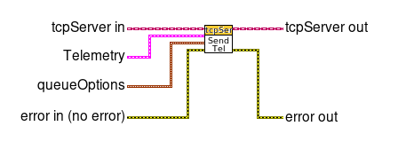
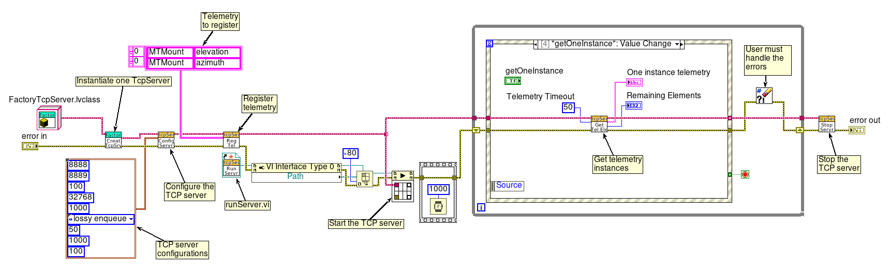
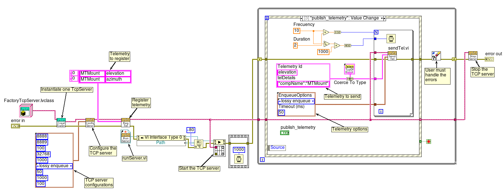

# TCP Server User Manual

## Overview

The `TcpServer` is a module to exchange commands, events, and telemetry with a TCP client, using a TCP/IP connection.
The JSON string packet is used in this process.
Click [here](../README.md#header-of-json-string) for more details.

You can use this module as an interface between a TCP client and a LabVIEW component.

## Design

The `TcpServer` is developed with the Object-Oriented Design (OOD).
The class diagram is in `doc/uml` directory.
You can follow [here](../doc/uml/TcpServerClass.uml) for details.
However, you only need to use the public functions of the **TcpServer** class.

## TcpServer Library

The `TcpServer` module provides a library of VIs for the TCP/IP communication.
The following is a brief description of the main VIs.

## configServer&#46;vi

The configServer VI is used to configure the TCP server, with the port, the number of bytes to read, and other parameters, using the `ServerConfiguration` cluster.
Click [here](#server-configuration-cluster) to more details about this cluster.

## runServer&#46;vi

The runServer VI is used to run the TCP server.

## stopServer&#46;vi

The stopServer VI is used to stop all servers.

## Using the TcpServer to receive commands

The following is a brief description of the main VIs you have to use to work with **commands** in the TCP server, and an example how to implement the server, using the JSON packet to receive the commands.

## getInstanceCmd&#46;vi

The getInstanceCmd VI is used to get the `CmdRead` user event instance, to read commands from the TCP client.

## regCmd&#46;vi

The regCmd VI is used to inform the TCP server which commands are registered and allowed to be used by the LabVIEW component.
Please define all of the registered commands in the `cmdReg` 1D array of strings.

## sendCmdStatus&#46;vi

The sendCmdStatus VI is used to send a `cmdStatus` message to the TCP server to inform the TCP client about the command result.
You need to add the `sequence_id` of the command received as an input of this function.
Click [here](../README.md#header-of-json-string) for more details about the JSON packet.

The following image shows an example of a TCP server using the library to receive commands from a TCP client.

Notice that this program configures the TCP server, registers the allowed commands (`move` and `start` in this example), gets the user event reference to receive the commands, runs, and stops the TCP server.

This example registers the `CmdRead` user event and waits for it.
When the command is received it is showed in the `Command Received` indicator.

The [Start Asynchronous Call VI](https://zone.ni.com/reference/en-XX/help/371361R-01/lvconcepts/asynchronous_vi_calls/) is used and recommended to run the **runServer.vi**, but you can also call this vi (runServer.vi) directly as a process.

After receiving the commands you can send the result of the execution, using the **sendCmdStatus.vi** with the `sequence_id` of the received command.

## Using the TcpServer to receive and send events

The following is a brief description of the main VIs you have to use to work with **events** in the TCP server, and an example how to implement the server, using the JSON packet to receive the events.

## regEvt&#46;vi

The regEvt VI is used to inform the TCP server which events are registered and allowed to be processed.
Please define all of the registered events in the `evtReg` 2D array of strings, using the following structure:

| Component Name | Event Name  |
|:--------------:|:-----------:|
|  component 1   |   event 1   |
|  component 2   |   event 2   |

## getInstanceEvt&#46;vi

The getInstanceEvt VI is used to get the `EvtRead` user event instance, to receive an event from the TCP client.
The event received is a JSON packet.

The following image shows an example of a TCP server using the library to receive events.

Notice that this program configures the TCP server, registers the allowed events, gets the user event reference to receive the events, and runs the TCP server.

This example registers the `EvtRead` user event and waits for it.
When the event is received it is showed in the `Event Received` indicator.

If you need to send an event to the TCP client use the **sendEvt.vi** function as the following images shows.

There is a polymorphic VI to help the user write the JSON string easily.
It is called **convertToKeyValuePair.vi** and you can go [here](../src/README.md#utility) for more details about this function.

## Using the TcpServer to receive and send telemetry

The following is a brief description of the main VIs you have to use to work with **telemetry** in the TCP server, and an example how to implement the server, using the JSON packet.

## regTel&#46;vi

The regTel VI is used to inform the TCP server which telemetry is registered and allowed to be used by LabVIEW component.
Please define all of the registered telemetry in the `telReg` 2D array of strings,
using the following structure:

| Component Name |  Telemetry Name  |
|:--------------:|:----------------:|
|  component 1   |   telemetry 1    |
|  component 2   |   telemetry 2    |

## sendTel&#46;vi

The sendTel VI is used to send the telemetry to the TCP client.

The `queueOptions` cluster control allows you to select how to add new elements into the telemetry queue.

If you select `normal enqueue` in the `Enqueue Elements` enum and `Timeout (ms)` is zero, you will implement the `block call` technique.

If you select `normal enqueue` in the `Enqueue Elements` enum and `Timeout (ms)` is greater than zero, you will implement the `un-block` call technique.

If you select `lossy enqueue` in the `Enqueue Elements` enum, you will implement the `circular buffer` and the `un-block call` technique.
In this case the `Timeout (ms)` value is not used.

There is a polymorphic VI to help the user write the JSON string easily.
It is called **convertToKeyValuePair.vi** and you can go [here](../src/README.md#utility) for more details about this function.

## getTelElement&#46;vi

The getTelElement VI is used to get telemetry elements one by one from the telemetry queue.
The timeout is set in **configServer&#46;vi** but you can modify this using the `telQueueServerTimeout` cluster control.

The following image shows an example of a TCP server using the library to receive telemetry, getting only one instance of the telemetry.
This uses the **getTelElement&#46;vi**.

Notice that this program configures the TCP server, registers the allowed telemetry, and runs the TCP server.
The telemetry does not use user events, as you can see in the image.

The following image shows an example of a TCP server using the library to send one instance of telemetry.
This uses the **sendTel&#46;vi**.

Please define the telemetry with the `Telemetry Id` and `telDetails` strings, and the `queueOptions` cluster, as the image shows.

The following image shows an example of a TCP server using the library to publish telemetry.

Notice that this program uses a `for` loop to add telemetry elements with the `Frecuency` and `Duration` numerics.

Please define the telemetry with the `Telemetry Id` and `telDetails` strings, and the `queueOptions` cluster.

## Connection Status

There is a VI called **getClientStatus&#46;vi** that allows you to know whether the connections between the TCP clients and TCP server are alive or not.
If all the TCP clients connect to the TCP servers, a `GenRead` user event is triggered with the string message `Clients are on`.
If one of the TCP clients disconnects, a `GenRead` user event is triggered with the string message `Clients are off`.

## TCP Server Internal Error Detection

The `TcpServer` module uses the `GenRead` user event to send the explanation of the errors that occur internally.
The error is cleared by the module and the user has to manage it.
The error explanation comes from the error LabVIEW internal database.

## Server Configuration Cluster

In the following table you can find the parameters of the `ServerConfiguration` cluster:

| Parameter   | Description         |
|:---------------:|:-------------------:|
| cmdServerPort | TCP port used by native LabVIEW TCP functions in TcpServer Command |
| telServerPort | TCP port used by native LabVIEW TCP functions in TcpServer Telemetry|
| serverTimeout (ms) | Time in ms that the `TCP Wait on Listener` function waits for a TCP connection |
| serverBytesToRead | Bytes to be read by the `TCP Read` LabVIEW function |
| maxSizeQueueTel | Max size of the `queueTel` queue in TcpServer Telemetry |
| EnqueueOptions | Select how to add new elements into the telemetry queue, using whether `Enqueue Elements` function or `Lossy Enqueue Element` function |
| timeoutQueueTel (ms) | Timeout in ms used in `Dequeue Element` function in LabVIEW Component to get the telemetry from TCP Client. |
| tcpClientQueueMaxSize | Set the max size of the `tcpClientQueue` queue |
| timeoutInMs | Timeout in ms used by the LabVIEW Occurrence functions |
