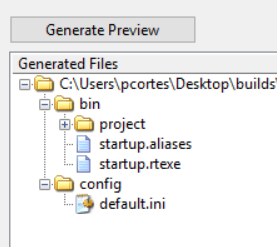

# LabVIEW Component Simulator

The Component Simulator allows you to call the LabVIEW TCP Server to test the TCP communication between the TCP Server and the TCP Client.
The LabVIEW TCP Server receives json commands from the Python TCP Client, and send ack and events back to the client, using TCP packets.

## Configuration File

The configuration file is in the `config/` directory.
The following is the detail:

1. [default.ini](../doc/detailsDefault.md): This file stores the **id** of commands, **id** and **compName** of events, and **id** and **compName** of telemetry.
LabVIEW Component will read this file to register commands, events and telemetry in TCP Server.

### Start Component Simulator

From terminal:

Go to the `build/` directory:

```sh
cd  ts_labview_tcp_json/build
```

Execute Component Simulator:

```sh
./ComponentSimulator
```

Note: this command will start two instances of the Component Simulator.

From LabVIEW project:

Go to the `simulator/` directory, find `ComponentSimulatorLauncher.vi`, press right click on it and select **Run**.

Please check these settings in one of the instance:

- cmdServerPort = 50000
- telServerPort = 50001
- timeoutServerInMs = 100
- serverBytesToRead = 32768
- maxSizeQueueTcpClientFromDds = 1000
- EnqueueOptions = lossy enqueue
- timeoutQueueTcpClientFromDds (ms) = 50
- maxSizeQueueTcpClient = 100

Plese check in the other instance these settings:

- cmdServerPort = 50010
- telServerPort = 50011
- timeoutServerInMs = 100
- serverBytesToRead = 32768
- maxSizeQueueTcpClientFromDds = 1000
- EnqueueOptions = lossy enqueue
- timeoutQueueTcpClientFromDds (ms) = 50
- maxSizeQueueTcpClient = 100

Note: this configuration cannot be modified in runtime.

### Available Commands

As User you will have the possibility to tell TCP Server which commands are allowed, through the use of the `default.ini` file.
You can click [here](../config/default.ini) to check which commands will be allowed.
If you send any of them, you will get the `ack` message in TCP Client.
If you send a different command, you will get the `noack` in TCP Client.

NOTE:

1. If you change any of them in the `default.ini` file, you will have to restart the Component Simulator.

### Send Command Status to TCP Client

If you want to send the Command Status to the TCP Client, do:

- Go to tab "Set Ack Cmd Status".
- Click "Success" to inform the TCP Client the command was executed successfully.
- Click "Fail" to inform the TCP Client the command was executed with fails.
- Read the Command Status in TCP Client.

### Send Events to TCP Client

If you want to send Events to TCP Client, do:

- Go to tab "Send Event".
- Write a name in Event Id control.
- Write details in Event Details control.
- Click "Send Event" to send the event.
- Read the event in TCP Client.

The structure of this Event is, for instance:

| Event Id |    Event Details    |
|:--------:|:-------------------:|
|   move   | "InPosition" : true |
|          | "Tolerance" : 0.2   |

You can send another Event Id with other Event Details.

Note:

1. If you want to send a boolean in Event Details, please use non capital letters, for instance `true` or `false`.

### Send Telemetry to TCP Client

If you want to send telemetry to TCP Client, do:

- Go to tab "Send Telemetry".
- Write a name in Telemetry Id control.
- Write details in Telemetry Details control.
- Click "Send one instance Telemetry" to send the only one instance.
- Read the telemetry in TCP Client.

The structure of this telemetry is, for instance:

| Telemetry Id |   Telemetry Details    |
|:------------:|:----------------------:|
|   elevation  |  "measuredInDeg" : 30  |
|              |                        |

You can send another Telemetry Id with other Telemetry Details.

- Click "Publish Telemetry" for telemetry published with a Frecuency (Hz) and a Duration (sec).

Note:

1. Before publish this telemetry you have to subscribe to this telemetry in TCP Client.
2. It is recommended to add more time in Duration option when subscribe to this telemetry in TCP Client.

### Receive Events from TCP Client

TCP Server will receive Events that LabVIEW component subscribed through the [default.ini](../config/default.ini) file.

### Receive Telemetry from TCP Client

- Press the "Get Queue Size" button to know how many elements are in the queue.
- Press the "Flush Telemetry" button to remove all elements in the queue.
They will be shown in "Telemetry Flushed" indicator.
- Press the "Get one instance Telemetry" button to read telemetry in the queue one by one.
You can see the elements in queue in "Remaining Elements" indicator.

### Stop Component Simulator

To stop the Component Simulator click to "Stop Simulator" button.

Note:

1. You can only stop the Simulator Component if you stop the TCP Server before.
2. If you want to stop the TCP Client while the TCP Server is running, the Server will wait for a new TCP Client connection.

## General Comments

- The **ComponentSimulator.vi** uses property nodes to modify control and indicator values, for visual behavior only.
If you want to use this vi as a top-level vi and want to compile it in a real-time target, avoid using property nodes.
Since in real-time target there is no front panel, no value will be written to the front panel controls and indicators, and this can cause unexpected vi behavior, as is explained in [this document](https://knowledge.ni.com/KnowledgeArticleDetails?id=kA00Z000000kGsVSAU&l=en-US).
- If you want to use this simulator in a real-time target, create the build specification, go to the properties, and follow this:
    - Go to `Source Files` category and add the `default.ini` file in the `Always Included` box.
    - Go to `Destinations` category and click the blue cross (+) under the `Destination` box to create a new directory.
    Name it `config` and modify the path in the `Destination path` box as `/home/lvuser/natinst/config`.
    - Go to `Source File Settings` category, click the `default.ini` file in the `Porject Files` box, and select `config` in the `Destination` combo box.
    - Go to `Preview` category and click `Generate Preview`.
   The preview should look like the following:
    
    
